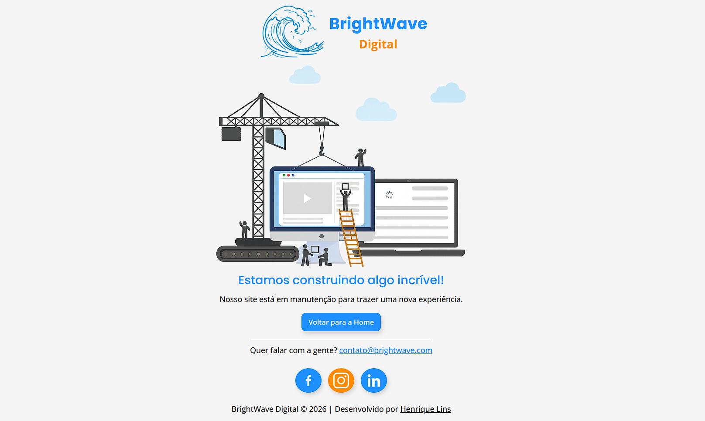

# 🚧 BrightWave Digital | Página em Construção

Uma página moderna e responsiva de **"Em Construção"**, desenvolvida para uma agência fictícia de marketing digital chamada **BrightWave Digital**.

O projeto foi criado com foco em boas práticas de HTML e CSS, organização de código, acessibilidade e responsividade.

## 📸 Preview



## 🔗 Acesse o projeto

- 🌐 **Projeto Online:** [Visualizar Projeto](https://henrique-aragao.github.io/brightwave-digital-construction/)
- 💻 **Repositório:** [Ver Repositório](https://github.com/henrique-aragao/brightwave-digital-construction)

---

## 📋 Sobre o projeto

Este projeto simula a página temporária de uma empresa enquanto seu novo site está sendo desenvolvido.

O principal objetivo foi criar uma interface simples, moderna e agradável, oferecendo uma boa experiência ao usuário em diferentes tamanhos de tela.

---

## 📚 Jornada de Desenvolvimento

Este projeto é o **Projeto 4** da minha jornada pessoal de desenvolvimento, composta por **20 projetos práticos**.

Cada projeto foi planejado para aprimorar habilidades específicas, aplicando boas práticas de desenvolvimento e evoluindo gradualmente a qualidade do código.

---

## ✨ Funcionalidades

- Página em construção com design moderno.
- Layout totalmente responsivo.
- Botão para retorno à página inicial.
- Área de contato com e-mail.
- Ícones para redes sociais.
- Logo personalizada.
- Favicon personalizado.
- Efeitos de hover e foco para melhor experiência de navegação.

---

## 🚀 Tecnologias utilizadas

- HTML5
- CSS3
- Google Fonts
- Flexbox

---

## 📱 Responsividade

O projeto foi desenvolvido seguindo a abordagem **Desktop First** e adaptado para diferentes dispositivos.

Compatível com:

- 💻 Desktop
- 📱 Smartphones
- 📲 Tablets

---

## ♿ Acessibilidade

Durante o desenvolvimento foram aplicadas algumas boas práticas de acessibilidade:

- Uso de HTML semântico.
- Atributos `alt` em todas as imagens.
- Estados de `:hover`.
- Estados de `:focus-visible`.
- Links acessíveis.
- Estrutura organizada para melhor leitura do código.

---

## 📂 Estrutura do projeto

```
📦 BrightWave-Digital
├── assets
│   ├── css
│   │   └── style.css
│   ├── icons
│   └── img
├── index.html
└── README.md
```

---

## 🎯 Objetivos de aprendizado

Este projeto faz parte da minha jornada de desenvolvimento, onde estou construindo diversos projetos para praticar e evoluir minhas habilidades.

Neste projeto o foco foi:

- Organização de arquivos.
- Estrutura semântica em HTML.
- Flexbox.
- Variáveis CSS.
- Responsividade.
- Acessibilidade.
- Boas práticas de CSS.

---

## 👨‍💻 Autor

Desenvolvido por **Henrique Lins**.

- GitHub: https://github.com/henrique-aragao
- LinkedIn: https://www.linkedin.com/in/henrique-lins-aragao

---

## 📄 Licença

Este projeto está sob a licença **MIT**.